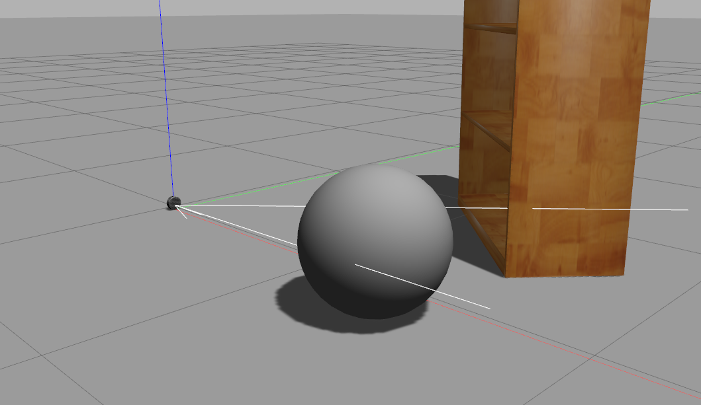

# Gazebo ROS L515

[](https://wiki.ros.org)
[](contributing.md)

**This repository contains all the code required for implementation of simulated RealSense L515 sensor with ROS in [Gazebo](https://gazebosim.org).**



*If you require gazebo implementation for other Intel Realsense cameras (ex: D435) please check the repositories mentioned in the acknowledgement section.*

## Install Dependencies
- [ROS](https://wiki.ros.org/ROS/Installation) 
- [Gazebo](https://gazebosim.org/tutorials?tut=install_ubuntu&cat=install)
- [Gazebo-ROS](https://gazebosim.org/tutorials?tut=ros_installing&cat=connect_ros)

## Build the Package
If you already have a catkin workspace skip this step, else
```shell
mkdir -p ~/catkin_ws/src
cd ~/catkin_ws/src
```
**Clone the repository and the build the package**
```shell
git clone https://github.com/zohebabai/gazebo_ros_l515.git .
cd ..
catkin_make
cakin_make install
```

If not done already, Insert this in your `~/.bashrc` file for sourcing your workspace:
```shell
source ~/catkin_ws/devel/setup.bash
```

## Launch the ROS-Package
```shell
roslaunch realsense2_description view_l515_model_rviz_gazebo.launch
```

## Demo 
[Video](https://youtu.be/KoQNH7YahN8)

## Acknowledgement
The repository was created to fulfill the need for a package to use simulated L515 sensor in Gazebo. 
The repository is a combined modification of following repositories:
- [realsense-ros](https://github.com/IntelRealSense/realsense-ros)
- [realsense_gazebo_plugin](https://github.com/pal-robotics/realsense_gazebo_plugin)
- [realsense-ros-gazebo](https://github.com/rickstaa/realsense-ros-gazebo/)

*Thanks to my colleagues at [Inkers AI](https://inkers.ai) for all the support and resources.*
