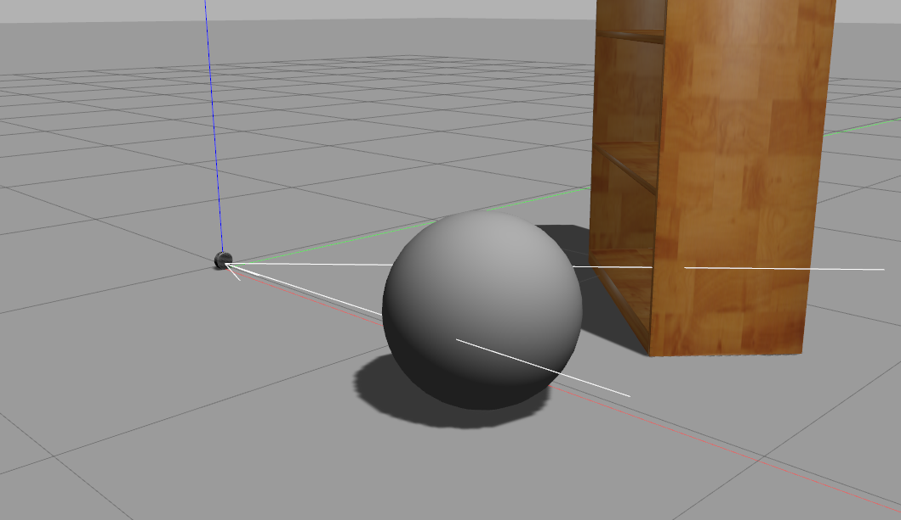

# Gazebo ROS L515 — ROS2 Jazzy + Gazebo Harmonic

[](https://docs.ros.org)
[](https://gazebosim.org)
[](https://ubuntu.com)
[](LICENSE)

**Intel RealSense L515 LiDAR/RGB-D camera simulation for ROS2 Jazzy + Gazebo Harmonic.**

Simulates the full L515 sensor suite — RGB color image, depth image, infrared image, and colored
point cloud — without any physical hardware.

---

## Update 2025 — Complete Rewrite for Gazebo Harmonic

This version is a ground-up modernisation of the original package:

- **Ported to ROS2 Jazzy + Gazebo Harmonic (gz-sim8)** — drops all Gazebo Classic / ROS1 code
- **Fixed sensor data pipeline** — sensors now use explicit `<topic>` names in the URDF; data
  flows via `ros_gz_image` and `ros_gz_bridge` (the correct modern bridge pattern)
- **Removed dead code** — `RealSensePluginHarmonic` stripped of non-functional ROS2 publishers,
  unused heavy dependencies (`gz-sensors8`, `gz-rendering8`, `gz-common5`, `image_transport`,
  `camera_info_manager`) removed; build time cut from ~15 s to ~4 s
- **Fixed example files** — `example_robot_with_l515.launch.py` and the mobile robot URDF updated
  from Gazebo Classic APIs to Gazebo Harmonic (`ros_gz_sim`, `gz-sim-diff-drive-system`)
- **Added colorful demo scene** — 8 distinct objects at 1–5 m depth with auto-unpause; one command
  launches Gazebo + all bridges + RViz2 with RGB point cloud, color image, and depth image
- **Added automated tests** — 60 tests covering plugin symbols, lint, and launch file correctness
- **Updated RViz2 configs** — all display class names ported from ROS1 (`rviz/*`) to ROS2
  (`rviz_default_plugins/*`, `rviz_common/*`)

---



---

## Supported Platforms

| Component  | Version            |
|------------|--------------------|
| OS         | Ubuntu 24.04 LTS   |
| ROS        | ROS2 Jazzy Jalisco |
| Simulator  | Gazebo Harmonic (gz-sim 8) |

> ROS 1, older ROS2 distributions, Gazebo Classic, and older Ubuntu versions are **not supported**.

---

## Architecture

Sensor data flows from Gazebo to ROS2 via the `ros_gz_bridge` / `ros_gz_image` bridge — the
recommended modern pattern for Gazebo Harmonic. The `RealSensePluginHarmonic` Gazebo system plugin
handles camera discovery and lifecycle; sensor rendering is done by Gazebo's built-in ogre2 engine.

```
Gazebo Harmonic (ogre2 renderer)
  ├─ /camera/color        [gz.msgs.Image]          ──ros_gz_image──► /camera/color/image_raw
  ├─ /camera/depth        [gz.msgs.Image]          ──ros_gz_image──► /camera/depth/image_raw
  ├─ /camera/infra        [gz.msgs.Image]          ──ros_gz_image──► /camera/infra/image_raw
  ├─ /camera/depth/points [gz.msgs.PointCloudPacked] ──ros_gz_bridge──► /camera/depth/color/points
  └─ /camera/*/camera_info [gz.msgs.CameraInfo]   ──ros_gz_bridge──► /camera/*/camera_info
```

The short Gazebo topic names (`/camera/color`, `/camera/depth`, etc.) are set by `<topic>` elements
in `realsense2_description/urdf/_l515.gazebo.xacro`. Without these, Gazebo uses the full model
hierarchy path (`/world/{world}/model/{model}/link/{link}/sensor/{sensor}/image`).

---

## Installation

### 1. Install ROS2 Jazzy

```bash
# Verify Ubuntu 24.04
lsb_release -cs   # should print: noble

# Locale
sudo apt update && sudo apt install -y locales
sudo locale-gen en_US en_US.UTF-8
sudo update-locale LC_ALL=en_US.UTF-8 LANG=en_US.UTF-8
export LANG=en_US.UTF-8

# Add ROS2 repository
sudo apt install -y software-properties-common curl
sudo add-apt-repository universe
sudo curl -sSL https://raw.githubusercontent.com/ros/rosdistro/master/ros.key \
    -o /usr/share/keyrings/ros-archive-keyring.gpg
echo "deb [arch=$(dpkg --print-architecture) \
    signed-by=/usr/share/keyrings/ros-archive-keyring.gpg] \
    http://packages.ros.org/ros2/ubuntu noble main" \
    | sudo tee /etc/apt/sources.list.d/ros2.list > /dev/null

# Install
sudo apt update
sudo apt install -y ros-jazzy-desktop
```

### 2. Install Gazebo Harmonic

```bash
sudo apt install -y gz-harmonic

# Verify
gz sim --version
# Gazebo Sim, version 8.x.x
```

### 3. Install ROS-Gazebo Bridge and Build Dependencies

```bash
sudo apt install -y \
    ros-jazzy-ros-gz \
    ros-jazzy-ros-gz-sim \
    ros-jazzy-ros-gz-bridge \
    ros-jazzy-ros-gz-image \
    ros-jazzy-robot-state-publisher \
    ros-jazzy-joint-state-publisher \
    ros-jazzy-xacro \
    ros-jazzy-rviz2 \
    ros-jazzy-gz-sim-vendor \
    ros-jazzy-gz-plugin-vendor
```

### 4. Create Workspace and Clone

```bash
mkdir -p ~/ros2_ws/src
cd ~/ros2_ws/src
git clone https://github.com/ZohebAbai/gazebo_ros_l515.git
cd ~/ros2_ws
```

### 5. Build

```bash
source /opt/ros/jazzy/setup.bash
colcon build --symlink-install
```

Expected output:
```
Starting >>> realsense_gazebo_plugin
Starting >>> realsense2_description
Finished <<< realsense_gazebo_plugin [~4s]
Finished <<< realsense2_description [~1s]

Summary: 2 packages finished
```

### 6. Source the Workspace

```bash
source ~/ros2_ws/install/setup.bash

# Add to shell rc so every new terminal picks it up
echo "source /opt/ros/jazzy/setup.bash" >> ~/.bashrc
echo "source ~/ros2_ws/install/setup.bash" >> ~/.bashrc
```

---

## Demo — Colorful Indoor Scene

The quickest way to see the L515's full capability. Spawns the camera in a colorful scene with
8 distinct objects at depths from 1 m to 5 m and opens RViz2 showing the colored point cloud,
color image, and depth image side by side.

```bash
ros2 launch realsense2_description demo.launch.py
```

**What you will see:**

| RViz2 Display   | Topic                          | Description                       |
|-----------------|--------------------------------|-----------------------------------|
| PointCloud2     | `/camera/depth/color/points`   | RGB-colored 3-D point cloud       |
| Color Image     | `/camera/color/image_raw`      | 1920×1080 RGB camera feed         |
| Depth Image     | `/camera/depth/image_raw`      | Depth map (normalized to 0–5 m)   |

**Scene objects (camera at origin, objects along +X axis):**

| Object          | Depth  | Color  |
|-----------------|--------|--------|
| Red box         | 1.0 m  | Red    |
| Yellow cylinder | 1.1 m  | Yellow |
| Green sphere    | 1.8 m  | Green  |
| Blue sphere     | 2.2 m  | Blue   |
| White box       | 2.6 m  | White  |
| Orange pillar   | 3.0 m  | Orange |
| Purple box      | 3.8 m  | Purple |
| Cyan sphere     | 4.5 m  | Cyan   |
| Back wall       | 5.5 m  | Off-white (depth stop) |

To launch without RViz (headless):
```bash
ros2 launch realsense2_description demo.launch.py rviz:=false
```

---

## Other Launch Options

### Camera model in RViz only (no simulation)

Inspect the URDF/TF tree without Gazebo:

```bash
ros2 launch realsense2_description view_l515_model.launch.py
```

### Camera in Gazebo + RViz (empty world)

```bash
ros2 launch realsense2_description view_l515_model_rviz_gazebo.launch.py
```

### Gazebo only (headless / scriptable)

```bash
ros2 launch realsense2_description gazebo.launch.py
```

### Example mobile robot with L515

Demonstrates mounting the L515 on a diff-drive robot:

```bash
ros2 launch realsense2_description example_robot_with_l515.launch.py
```

---

## Verify Topics

After any Gazebo launch, in a new terminal:

```bash
source ~/ros2_ws/install/setup.bash
ros2 topic list
```

Expected topics:
```
/camera/color/camera_info
/camera/color/image_raw
/camera/depth/camera_info
/camera/depth/color/points
/camera/depth/image_raw
/camera/infra/camera_info
/camera/infra/image_raw
/clock
/robot_description
/tf
/tf_static
```

Check data rates:
```bash
# Color image — expect ~30 Hz
ros2 topic hz /camera/color/image_raw

# Point cloud — expect ~30 Hz
ros2 topic hz /camera/depth/color/points

# Print one camera_info message
ros2 topic echo /camera/color/camera_info --once
```

---

## Adding the L515 to Your Own Robot

Include the L515 macro in your URDF/xacro:

```xml
<!-- In your robot's .urdf.xacro -->
<xacro:include filename="$(find realsense2_description)/urdf/_l515.urdf.xacro" />

<xacro:sensor_l515
    name="camera"
    topics_ns="camera"
    parent="base_link"
    use_nominal_extrinsics="true"
    publish_pointcloud="true">
  <origin xyz="0.1 0 0.2" rpy="0 0 0" />
</xacro:sensor_l515>
```

See [INTEGRATION_GUIDE.md](INTEGRATION_GUIDE.md) for the full parameter reference and example
launch file.

---

## Automated Tests

```bash
# Run all lint + unit tests
colcon test --packages-select realsense_gazebo_plugin realsense2_description
colcon test-result --verbose
```

Tests verify:
- Plugin shared object is a valid ELF with correct GZ symbols
- No dead `image_transport` / `camera_info_manager` symbols in the plugin
- All launch files use Gazebo Harmonic APIs (`ros_gz_sim`, not `gazebo_ros`)
- Bridge strings use the correct `@` separator format
- All three camera topics (color, depth, infrared) are bridged

---

## Troubleshooting

### `gz sim: command not found`
```bash
sudo apt install gz-harmonic
```

### `Package 'ros_gz_sim' not found`
```bash
sudo apt install ros-jazzy-ros-gz-sim
```

### `Unable to parse robot_description as yaml`

Ensure you source the workspace **after** building:
```bash
source ~/ros2_ws/install/setup.bash
```

### No camera topics after launch

1. Check that the plugin loaded — look for this line in the launch terminal:
   ```
   RealSensePluginHarmonic: All sensors found.
   ```
2. If missing, the SDF sensor names may not match. Verify with:
   ```bash
   gz topic -l   # list all Gazebo topics
   ```

### RViz shows "No data received" on PointCloud2

Wait 5–10 seconds for Gazebo to finish loading the world and start publishing. The bridge starts
before Gazebo is fully ready.

### Point cloud appears white (no color)

In RViz2, select the PointCloud2 display and set **Color Transformer** to `RGB8`.

### Build fails with missing gz-sim8 headers
```bash
sudo apt install ros-jazzy-gz-sim-vendor ros-jazzy-gz-plugin-vendor
```

### Clean rebuild
```bash
cd ~/ros2_ws
rm -rf build install log
source /opt/ros/jazzy/setup.bash
colcon build --symlink-install
```

---

## Repository Structure

```
gazebo_ros_l515/
├── realsense2_description/       # ROS2 package — URDF, launch, worlds, RViz configs
│   ├── launch/
│   │   ├── demo.launch.py                      # Colorful demo scene (start here)
│   │   ├── gazebo.launch.py                    # Gazebo only (empty world)
│   │   ├── view_l515_model.launch.py           # RViz URDF viewer
│   │   ├── view_l515_model_rviz_gazebo.launch.py  # Gazebo + RViz
│   │   └── example_robot_with_l515.launch.py  # Mobile robot example
│   ├── urdf/
│   │   ├── _l515.urdf.xacro                    # L515 sensor macro (include this)
│   │   ├── test_l515_camera.urdf.xacro         # Standalone camera for testing
│   │   └── example_mobile_robot_with_l515.urdf.xacro
│   ├── worlds/
│   │   └── l515_demo.sdf                       # Colorful demo world (8 objects)
│   ├── rviz/
│   │   ├── demo.rviz                           # Demo config (RGB point cloud)
│   │   └── urdf.rviz                           # URDF viewer config
│   └── meshes/                                 # L515 3-D mesh files
└── realsense_gazebo_plugin/      # Gazebo system plugin (camera lifecycle)
    ├── include/realsense_gazebo_plugin/
    │   └── RealSensePluginHarmonic.h
    └── src/
        └── RealSensePluginHarmonic.cpp
```

---

## System Requirements

| Component | Minimum          | Recommended       |
|-----------|------------------|-------------------|
| CPU       | 4-core @ 2 GHz   | 8-core @ 3 GHz    |
| RAM       | 8 GB             | 16 GB             |
| GPU       | Integrated       | Dedicated (NVIDIA/AMD) |
| Disk      | 10 GB free       | 20 GB free        |

---

## Acknowledgements

This repository is a combined modification of:
- [realsense-ros](https://github.com/IntelRealSense/realsense-ros) — Intel RealSense ROS2 driver
- [realsense_gazebo_plugin](https://github.com/pal-robotics/realsense_gazebo_plugin) — PAL Robotics Gazebo plugin
- [realsense-ros-gazebo](https://github.com/rickstaa/realsense-ros-gazebo/) — RickStaa's combined package

---

## Contributing

Issues and pull requests are welcome at
[github.com/ZohebAbai/gazebo_ros_l515](https://github.com/ZohebAbai/gazebo_ros_l515/issues).

## License

Apache 2.0 — see [LICENSE](LICENSE).
